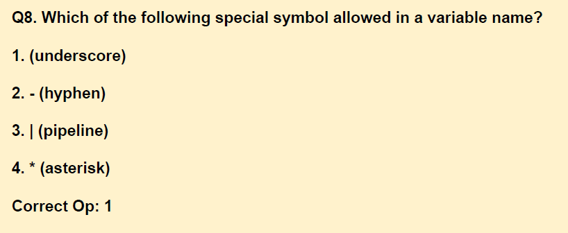

solution: 
`
In C programming, a variable name can consist of a combination of letters both in lower case and upper case, digits, or integer numbers, and only one special symbol underscore (_). A variable name may begin with a letter or an underscore. Other than underscore(_), no other special symbol can be used in a variable name.
`